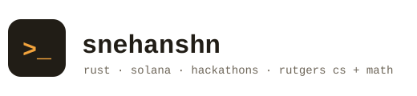

<picture>
  <source media="(prefers-color-scheme: dark)" srcset="assets/header-dark.svg">
  
</picture>

CS + Math at Rutgers. Engineer at [NovaFlow](https://www.novaflowapp.com).

Most of my code takes raw Solana transactions and turns them into something a human can read. Fair is fair:

```jsonc
// $ sne --decode
{
  "signer": "Sne (Snehanshn Chowdhury)",
  "programs": ["Rust", "TypeScript", "Python"],
  "accounts": ["yuno-research", "NovaFlow", "Rutgers CS + Math"],
  "instructions": [
    "decode Solana transactions into things humans can read",
    "ship product at NovaFlow",
    "enter hackathons at an unreasonable rate"
  ],
  "recent_activity": "pushed to SnehanshnC/snehanshn-site on 2026-07-13",
  "logs": "https://snehanshn-site.vercel.app"
}
```

## Selected work

- [solana_tx_decoding](https://github.com/yuno-research/solana_tx_decoding) - raw Solana transactions in, standardized swaps and token creations out. Rust.
- [solana_central](https://github.com/yuno-research/solana_central) - the shared types, IDLs, and DEX pool state everything else leans on. Also Rust.
- [marketowl](https://github.com/rayedchow/marketowl), [honeyflow](https://github.com/rayedchow/honeyflow), [quarry-ai](https://github.com/rayedchow/quarry-ai) - hackathon builds with friends (HackPrinceton, ETHDenver, HackRU). Some went well.

More at [snehanshn-site.vercel.app](https://snehanshn-site.vercel.app). There's a terminal in there. Press `/`.
